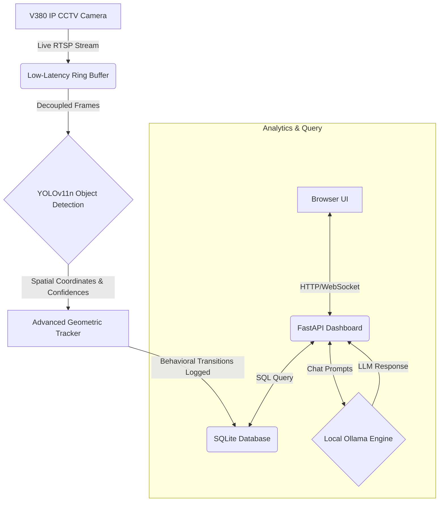

# V380-YOLO: Edge AI Telemetry Pipeline

A local, cloud-free telemetry and security analysis suite for IP cameras. It transforms a standard RTSP feed into a rich, queryable source of behavioral data by tracking human and animal movements, logging activity patterns, and providing a natural language interface for summaries—all completely offline.

---

## How It Works

The pipeline is designed for high performance and low resource consumption, making it ideal for running on consumer-grade hardware without impacting system performance for other tasks like gaming or development.



- **Smooth Video Ingestion**: A dedicated threading model isolates the RTSP stream decoding from the main application logic. This ensures the live video feed remains fluid (targeting 30 FPS) while preventing the resource-intensive AI computations from causing system-wide lag.
- **Lightweight Behavioral Tracking**: Instead of relying on heavy deep learning models for action recognition, the system uses efficient geometric calculations. It tracks the aspect ratio, velocity, and trajectory of bounding boxes to infer states like `Sitting/Working`, `Standing/Moving`, or `Pacing`, keeping CPU/GPU usage to a minimum.
- **Natural Language Summaries**: A custom translation layer sanitizes raw database logs (e.g., `2024-05-24 14:22:17`, `Pacing/Moving`) into clean, human-readable context. This allows the local Large Language Model (`llama3.2:1b`) to generate concise, conversational summaries of room activity without "hallucinating" or exposing technical jargon.

---

## The Tech Stack

- **OS**: Cross-Platform (Linux, macOS, Windows)
- **Backend**: FastAPI with Uvicorn ASGI server
- **Computer Vision**: OpenCV-Python (Headless) & Ultralytics YOLOv11n (OpenVINO optimized)
- **Database**: SQLite 3
- **AI Engine**: Ollama running `llama3.2:1b`

---

## Project Structure

```text
v380-yolo/
├── .gitignore               # Excludes virtual envs, DB files, and cache from Git
├── README.md                # This file
├── requirements.txt         # Python package dependencies
├── dashboard_app.py         # Main application source code
└── yolo11n_openvino_model/  # Pre-trained and optimized object detection model
    ├── metadata.yaml
    ├── yolo11n.bin
    └── yolo11n.xml
```

---

## Getting Started

Because the pipeline relies on headless packages and standardized protocols, it runs identically across Linux, macOS, and Windows.

### 1. Set Up a Virtual Environment

Create and activate a clean Python environment.

**Linux / macOS:**
```bash
python -m venv venv
source venv/bin/activate
```

**Windows (PowerShell):**
```powershell
python -m venv venv
.\venv\Scripts\Activate.ps1
```

**Windows (Command Prompt):**
```dos
python -m venv venv
.\venv\Scripts\activate.bat
```

### 2. Install Dependencies

Install the required packages using the headless versions to avoid potential GUI driver conflicts on servers.
```bash
pip install -r requirements.txt
```

### 3. Spin Up Ollama (Local AI Engine)

Ensure your local Ollama instance is running. The application will automatically attempt to pull the required model if it's not present.

- **Linux**: Start the `ollama` service (`sudo systemctl start ollama`) or run `ollama serve &`.
- **Windows / macOS**: Launch the Ollama Desktop application.

The app will automatically run the equivalent of `ollama pull llama3.2:1b` on first launch if the model is missing.

### 4. Configure and Launch the Pipeline

Set your camera's RTSP stream URL as an environment variable before launching the app. This keeps your credentials secure and out of the source code.

**Linux / macOS:**
```bash
export RTSP_URL="rtsp://<username>:<password>@<camera-ip-address>:554/live/ch00_0"
python dashboard_app.py
```

**Windows (PowerShell):**
```powershell
$env:RTSP_URL="rtsp://<username>:<password>@<camera-ip-address>:554/live/ch00_0"
python dashboard_app.py
```

**Windows (Command Prompt):**
```dos
set RTSP_URL="rtsp://<username>:<password>@<camera-ip-address>:554/live/ch00_0"
python dashboard_app.py
```

Once running, open your browser and navigate to **http://localhost:8050** to access the live analytics dashboard.

---

## Privacy & Security

- **100% Offline**: No data ever leaves your local machine. There are no cloud subscriptions, remote API keys, or tracking telemetry.
- **Secure by Design**: Credentials are handled via environment variables (`os.getenv`), ensuring sensitive information like usernames, passwords, and IP addresses are never hardcoded or accidentally committed to a public repository.
